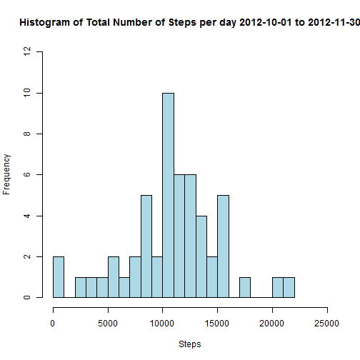
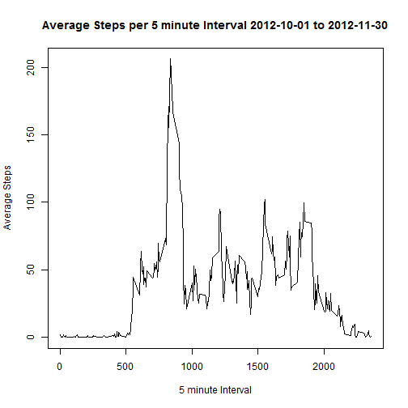
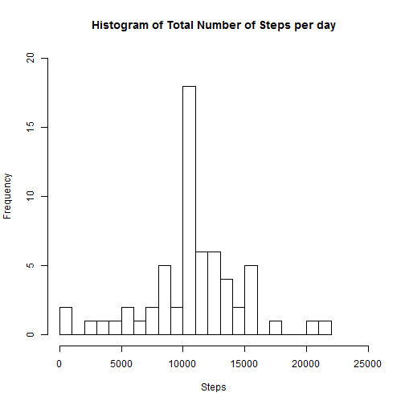
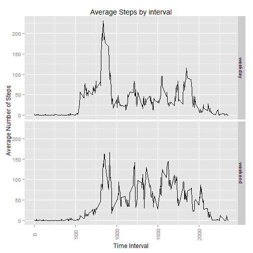

## Loading and preprocessing the data

Load the data and convert it to a data table. 


```r
library(data.table)

raw_data = read.csv("./activity/activity.csv", header = TRUE, stringsAsFactors = FALSE)

#convert to data table
data_dt = as.data.table(raw_data)
setkey(data_dt, date)
```


## What is mean total number of steps taken per day?

Step 1: Make a histogram of the total number of steps per day
Note that NA values have been left in.  Values have not been set to zero
as this would skew the histogram i.e. we have no idea on what the total number
of steps taken on these days.


```r
# extract daily totals
data_dt_days = data_dt[,lapply(.SD,sum), by = date, .SD="steps"]
setnames(data_dt_days,2,"steps")

#Plot histogram with 20 intervals
hist(data_dt_days$steps,20, 
     main="Histogram of Total Number of Steps per day", xlab ="Steps",
     xlim = c(0,25000), ylim = c(0,12))
```

 

Step 2: Calculate and report the mean and median total number of steps taken per day


```r
# note NA removed so mean and median are only on days that have data

# Calculate mean 
data_dt_days[,mean(steps,na.rm = TRUE),]
```

```
## [1] 10766.19
```

```r
# Calculate median
data_dt_days[,median(steps,na.rm = TRUE),]
```

```
## [1] 10765
```


## What is the average daily activity pattern?

Step 1 Make a time series plot of the 5-minute interval and the average number of steps taken, averaged across all days


```r
# calculate the average of 5 minute time slots over all days
data_dt_intervals = tapply(data_dt$steps,as.factor(data_dt$interval),mean,na.rm=TRUE)

#plot the data
plot(rownames(data_dt_intervals),data_dt_intervals,type='l',
     main=paste0("Average Steps per 5 minute Interval ",data_dt$date[1]," to ",
                 data_dt$date[17568]),
     xlab="5 minute Interval",
     ylab="Average Steps")
```

 

Step 2. Which 5-minute interval, on average across all the days in the dataset, contains the maximum number of steps?


```r
#return which period has the maximum mean value

data_dt_intervals[which(data_dt_intervals==(max(data_dt_intervals)))]
```

```
##      835 
## 206.1698
```


## Imputing missing values

Step 1. Calculate and report the total number of missing values in the dataset


```r
# Determine the number of rows that have NA
data_dt[is.na(steps)]
```

```
##       steps       date interval
##    1:    NA 2012-10-01        0
##    2:    NA 2012-10-01        5
##    3:    NA 2012-10-01       10
##    4:    NA 2012-10-01       15
##    5:    NA 2012-10-01       20
##   ---                          
## 2300:    NA 2012-11-30     2335
## 2301:    NA 2012-11-30     2340
## 2302:    NA 2012-11-30     2345
## 2303:    NA 2012-11-30     2350
## 2304:    NA 2012-11-30     2355
```

```r
# Show days that have NA
data_dt_days[is.na(steps)]
```

```
##          date steps
## 1: 2012-10-01    NA
## 2: 2012-10-08    NA
## 3: 2012-11-01    NA
## 4: 2012-11-04    NA
## 5: 2012-11-09    NA
## 6: 2012-11-10    NA
## 7: 2012-11-14    NA
## 8: 2012-11-30    NA
```

Step 2 & 3. Devise a strategy for filling in all of the missing values in the dataset.
The method used was to replace the NA value with the average value of the 5 minute 
interval accross all days.


```r
# replace the NA in data set with average values for 5 minute intervals
data_dt_nas = data_dt
for (i in 1:nrow(data_dt_nas)){
        if (is.na(data_dt_nas$steps[i])) {
                data_dt_nas$steps[i]=
                        data_dt_intervals[which(row.names(data_dt_intervals)==data_dt_nas$interval[i])]
        }
}
```

Step 4 Make a histogram of the total number of steps taken each day and Calculate
and report the mean and median total number of steps taken per day.


```r
# Make a histogram and calculate mean and median
#Plot histogram with 20 intervals

data_dt_nas_days = data_dt_nas[,lapply(.SD,sum), by = date, .SD="steps"]
hist(data_dt_nas_days$steps,20, 
     main="Histogram of Total Number of Steps per day", xlab ="Steps",
     xlim = c(0,25000), ylim = c(0,20))
```

 

```r
# Calculate mean 
data_dt_nas_days[,mean(steps),]
```

```
## [1] 10766.19
```

```r
# Calculate median
data_dt_nas_days[,median(steps),]
```

```
## [1] 10766.19
```

These values differ from the set that includes "NA" as noted below.


```r
# Delta to original set
data_dt_days[,mean(steps,na.rm = TRUE),]-data_dt_nas_days[,mean(steps),]
```

```
## [1] 0
```

```r
data_dt_days[,median(steps,na.rm = TRUE),]-data_dt_nas_days[,median(steps),]
```

```
## [1] -1.188679
```
Total number of steps of the adjusted set has increased as shown below:


```r
# Calculate the total number of steps diference
sum(data_dt_nas_days$steps)-sum(na.omit(data_dt_days$steps))
```

```
## [1] 86129.51
```

It is also noted that the mean and median have the same value

## Are there differences in activity patterns between weekdays and weekends?

Step 1. Create a new factor variable in the dataset with two levels -- "weekday" and "weekend" indicating whether a given date is a weekday or weekend day.


```r
#Difference between Weekday and weekend
# Get new column and populate with day names
data_dt_nas$day_col = weekdays(strptime(data_dt_nas$date, format = "%Y-%m-%d"))
# New factor column and populate with weekend or weekday
data_dt_nas$day_col_week = factor(ifelse(data_dt_nas$day_col == "Saturday" | 
                                                 data_dt_nas$day_col == "Sunday", "weekend", "weekday"), 
                                  levels = c("weekday", "weekend"))
```

Step 2.Plot the two graphs of weekday and weekend over 5 minute interval.


```r
library(ggplot2)
# plot each of the point sources using ggplot
data_source <- data_dt_nas[,lapply(.SD,mean), by=list(interval,day_col_week), .SDcols = "steps"]

g <- ggplot(data_source, aes(interval,steps)) # Set the data

# plot used as data refers to only the years in question
g + geom_line(stat="identity") + facet_grid(day_col_week~.) + 
        labs(title = "Average Steps by interval",
             y = "Average Number of Steps", x="Time Interval") +
        theme(axis.text.x = element_text(angle = 90, vjust=0.5)) # add the elements
```

 

From the graphs we can see that the person starts walking later on the weekend and not as far in the morning.
