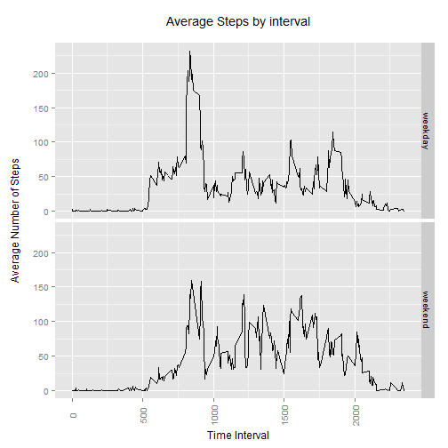

## Context

The document is Peer Assessment 1 for the Johns Hopkins University Cousera Programme - Reproducible Research.

It uses data downloaded from the course web site:

* Dataset: [Activity monitoring data](https://d396qusza40orc.cloudfront.net/repdata%2Fdata%2Factivity.zip) [52K]


The following steps was carried on the extract data file "activity.csv"

## Loading and preprocessing the data
For the purposes of simplification, it is assumed that persons reproducing this work have the ability to download the file and store it in an appropriate location on their system.

Load the data and convert it to a seperate data table.


```r
library(data.table)
```

```
## data.table 1.9.4  For help type: ?data.table
## *** NB: by=.EACHI is now explicit. See README to restore previous behaviour.
## 
## Attaching package: 'data.table'
## 
## The following object is masked _by_ '.GlobalEnv':
## 
##     .N
```

```r
data_dt = read.table("./activity/activity.csv", header = TRUE, sep=",", 
                   colClasses=c('integer','Date','integer'))

#convert to data table
data_dt = as.data.table(data_dt)
setkey(data_dt, date)
```


## What is mean total number of steps taken per day?

Step 1: Make a histogram of the total number of steps per day
Note that NA values have been left in and no changes have been made to their value, 
as we have no idea on what the total number of steps taken on these days.


```r
# extract daily totals
data_dt_days = data_dt[,lapply(.SD,sum), by = date, .SD="steps"]
setnames(data_dt_days,2,"steps")

#Plot histogram with 20 intervals
hist(data_dt_days$steps,20, 
     main=paste0("Histogram of Total Number of Steps per day ",data_dt$date[1],
                 " to ", data_dt$date[17568]), 
     col="Light Blue",
     xlab ="Steps",
     xlim = c(0,25000), ylim = c(0,12))
```

 

Step 2: Calculate and report the mean and median total number of steps taken per day


```r
# note NA removed so mean and median are only on days that have data

# Calculate mean 
data_dt_days[,mean(steps,na.rm = TRUE),]
```

```
## [1] 10766.19
```

```r
# Calculate median
data_dt_days[,median(steps,na.rm = TRUE),]
```

```
## [1] 10765
```

The mean and median number of steps are close and note days where no data has been recorded have not been included.

## What is the average daily activity pattern?

Step 1 Make a time series plot of the 5-minute interval and the average number of steps taken, averaged across all days


```r
# calculate the average of 5 minute time slots over all days
intervals_dt = data_dt[,lapply(.SD,mean,na.rm=T),by=interval, .SD='steps']
setkey(intervals_dt, interval)
setnames(intervals_dt,2,"ave_steps")


#plot the data
plot(intervals_dt$interval,intervals_dt$ave_steps,type='l',
     main=paste0("Average Steps per 5 minute Interval ",data_dt$date[1]," to ",
                 data_dt$date[17568]),
     col= "Dark Blue",
     xlab="5 minute Interval",
     ylab="Average Steps")
```

 

Step 2. Which 5-minute interval, on average across all the days in the dataset, contains the maximum number of steps?


```r
#return which period has the maximum mean value
intervals_dt[which(intervals_dt$ave_steps==max(intervals_dt$ave_steps))]
```

```
##    interval ave_steps
## 1:      835  206.1698
```


## Imputing missing values

Step 1. Calculate and report the total number of missing values in the dataset


```r
# Determine the number of rows that have NA
data_dt[is.na(steps)]
```

```
##       steps       date interval
##    1:    NA 2012-10-01        0
##    2:    NA 2012-10-01        5
##    3:    NA 2012-10-01       10
##    4:    NA 2012-10-01       15
##    5:    NA 2012-10-01       20
##   ---                          
## 2300:    NA 2012-11-30     2335
## 2301:    NA 2012-11-30     2340
## 2302:    NA 2012-11-30     2345
## 2303:    NA 2012-11-30     2350
## 2304:    NA 2012-11-30     2355
```

It is noted that given the total number of 5 minute periods in any one day is (24*60)/5 = 288 periods and from above there are 2304 intervals, the number of days with no data is 2304/288 = 8 days (exactly) and the dates of these are given below:


```r
# Show days that have NA
data_dt_days[is.na(steps)]
```

```
##          date steps
## 1: 2012-10-01    NA
## 2: 2012-10-08    NA
## 3: 2012-11-01    NA
## 4: 2012-11-04    NA
## 5: 2012-11-09    NA
## 6: 2012-11-10    NA
## 7: 2012-11-14    NA
## 8: 2012-11-30    NA
```


Step 2 & 3. Devise a strategy for filling in all of the missing values in the dataset.
Upon investigation of the data it was not surprising to find that the daily patterns of walking changed.  This is shown below:
<<<<<<< HEAD


```r
# Get new column and populate with day names
data_dt$day_col = weekdays(data_dt$date)

#Get the number of average number of steps per day 
intervals_dt_day = data_dt[,lapply(.SD,mean,na.rm=T),by=c('day_col','interval'), .SD='steps']

intervals_dt_day$day_col <- as.factor(intervals_dt_day$day_col)
setattr(intervals_dt_day$day_col,"levels",c("Monday","Tuesday","Wednesday"
                                        ,"Thursday","Friday","Saturday","Sunday"))

setnames(intervals_dt_day,3,"ave_steps")

library(ggplot2)
# plot each of the point sources using ggplot
data_source <- intervals_dt_day

g <- ggplot(data_source, aes(interval,ave_steps)) # Set the data

# plot used as data refers to only the years in question
g + geom_line(stat="identity") + facet_grid(day_col~.) + 
        labs(title = "Average Steps by interval per Day of the Week",
             y = "Average Number of Steps", x="Time Interval") +
        theme(axis.text.x = element_text(angle = 90, vjust=0.5)) # add the elements
```

 

From the graphs it is clear that a the steps varies depending on the day of the week. Thus if we were to replace the missing data with a simple average this would not be totally correct, so we will replace the missing data with the correct average daily data and correct averege for the interval.


```r
=======


```r
# Get new column and populate with day names
data_dt$day_col = weekdays(data_dt$date)

#Get the number of average number of steps per day 
intervals_dt_day = data_dt[,lapply(.SD,mean,na.rm=T),by=c('day_col','interval'), .SD='steps']

intervals_dt_day$day_col <- as.factor(intervals_dt_day$day_col)
setattr(intervals_dt_day$day_col,"levels",c("Monday","Tuesday","Wednesday"
                                        ,"Thursday","Friday","Saturday","Sunday"))

setnames(intervals_dt_day,3,"ave_steps")

library(ggplot2)
# plot each of the point sources using ggplot
data_source <- intervals_dt_day

g <- ggplot(data_source, aes(interval,ave_steps)) # Set the data

# plot used as data refers to only the years in question
g + geom_line(stat="identity") + facet_grid(day_col~.) + 
        labs(title = "Average Steps by interval per Day of the Week",
             y = "Average Number of Steps", x="Time Interval") +
        theme(axis.text.x = element_text(angle = 90, vjust=0.5)) # add the elements
```

 

From the graphs it is clear that a the steps varies depending on the day of the week. Thus if we were to replace the missing data with a simple average this would not be totally correct, so we will replace the missing data with the correct average daily data and correct averege for the interval.


```r
>>>>>>> a1821aae2dfb409a54fbd6faebbe3b78ac87cf3a
# Rev 0.4 improved this section by merging the average data into the data table
# rather then stepping through all the NA - thanks to discussion thread on
#  Joining two vectors - warning message - OP Jennifer Teed 
data_dt_nas = data_dt

data_dt_nas = merge(data_dt_nas,intervals_dt_day,by =c("day_col","interval"), all.y=TRUE)
data_dt_nas$steps[which(is.na(data_dt_nas$steps))] = data_dt_nas$ave_steps[which(is.na(data_dt_nas$steps))]
data_dt_nas$ave_steps=NULL
```

Step 4 Make a histogram of the total number of steps taken each day and Calculate
and report the mean and median total number of steps taken per day.


```r
# Make a histogram and calculate mean and median
#Plot histogram with 20 intervals

data_dt_nas_days = data_dt_nas[,lapply(.SD,sum), by = date, .SD="steps"]
hist(data_dt_nas_days$steps,20, 
     main=paste0("Histogram of Total Number of Steps per day ",data_dt$date[1],
                 " to ", data_dt$date[17568]),
     col="Light Blue",
     xlab ="Steps",
     xlim = c(0,25000), ylim = c(0,12))
```

 

```r
# Calculate mean 
data_dt_nas_days[,mean(steps),]
```

```
## [1] 10775.51
```

```r
# Calculate median
data_dt_nas_days[,median(steps),]
```

```
## [1] 11015
```
It is noted that the median and mean are still similar to the original calculations but differ as shown below.


```r
# Delta to original set
data_dt_days[,mean(steps,na.rm = TRUE),]-data_dt_nas_days[,mean(steps),]
```

```
## [1] -9.325698
```

```r
data_dt_days[,median(steps,na.rm = TRUE),]-data_dt_nas_days[,median(steps),]
```

```
## [1] -250
```
Total number of steps of the adjusted set has increased as shown below:


```r
# Calculate the total number of steps diference
sum(data_dt_nas_days$steps)-sum(na.omit(data_dt_days$steps))
```

```
## [1] 86698.38
```


## Are there differences in activity patterns between weekdays and weekends?

Step 1. Create a new factor variable in the dataset with two levels -- "weekday" and "weekend" indicating whether a given date is a weekday or weekend day.


```r
#Difference between Weekday and weekend
# Get new column and populate with day names
data_dt_nas$day_col = weekdays(data_dt_nas$date)
# New factor column and populate with weekend or weekday
data_dt_nas$day_col_week = factor(ifelse(data_dt_nas$day_col == "Saturday" | 
                                                 data_dt_nas$day_col == "Sunday", "weekend", "weekday"), 
                                  levels = c("weekday", "weekend"))
```

Step 2.Plot the two graphs of weekday and weekend over 5 minute interval.


```r
library(ggplot2)
# plot each of the point sources using ggplot
data_source <- data_dt_nas[,lapply(.SD,mean), by=list(interval,day_col_week), .SDcols = "steps"]

g <- ggplot(data_source, aes(interval,steps)) # Set the data

# plot used as data refers to only the years in question
g + geom_line(stat="identity") + facet_grid(day_col_week~.) + 
        labs(title = "Average Steps by interval",
             y = "Average Number of Steps", x="Time Interval") +
        theme(axis.text.x = element_text(angle = 90, vjust=0.5)) # add the elements
```

 

From the graphs you might believe that the person starts walking earlier on a weekday, but this is not entirely true as for each day the pattern varies as shown above in the daily step plots. 

This shows that assumptions based on broad trends may over look subtle details that become more apparent on investigation of the data.

## Appendix A - Data for reproducing this research.

For this assessment the data was downloaded from the above website on Jun 3 2015.

The SHA-1 hash for the downloaded zip file was:
02eb450a51703750115ccb63efada91b2ec49bb0

A summary of the system is given below:

```r
sessionInfo()
```

```
## R version 3.1.3 (2015-03-09)
## Platform: i386-w64-mingw32/i386 (32-bit)
## Running under: Windows 7 (build 7601) Service Pack 1
## 
## locale:
## [1] LC_COLLATE=English_Australia.1252  LC_CTYPE=English_Australia.1252   
## [3] LC_MONETARY=English_Australia.1252 LC_NUMERIC=C                      
## [5] LC_TIME=English_Australia.1252    
## 
## attached base packages:
## [1] stats     graphics  grDevices utils     datasets  methods   base     
## 
## other attached packages:
<<<<<<< HEAD
## [1] ggplot2_1.0.1    data.table_1.9.4 knitr_1.10.5    
## 
## loaded via a namespace (and not attached):
##  [1] chron_2.3-45     colorspace_1.2-6 digest_0.6.8     evaluate_0.7    
##  [5] formatR_1.2      grid_3.1.3       gtable_0.1.2     htmltools_0.2.6 
##  [9] labeling_0.3     magrittr_1.5     MASS_7.3-39      munsell_0.4.2   
## [13] plyr_1.8.2       proto_0.3-10     Rcpp_0.11.6      reshape2_1.4.1  
## [17] rmarkdown_0.6.1  scales_0.2.4     stringi_0.4-1    stringr_1.0.0   
## [21] tools_3.1.3      yaml_2.1.13
=======
## [1] knitr_1.10.5     ggplot2_1.0.1    data.table_1.9.4
## 
## loaded via a namespace (and not attached):
##  [1] chron_2.3-45     colorspace_1.2-6 digest_0.6.8     evaluate_0.7    
##  [5] formatR_1.2      grid_3.1.3       gtable_0.1.2     highr_0.5       
##  [9] htmltools_0.2.6  labeling_0.3     magrittr_1.5     markdown_0.7.7  
## [13] MASS_7.3-39      mime_0.3         munsell_0.4.2    plyr_1.8.2      
## [17] proto_0.3-10     Rcpp_0.11.6      reshape2_1.4.1   rmarkdown_0.6.1 
## [21] scales_0.2.4     stringi_0.4-1    stringr_1.0.0    tools_3.1.3     
## [25] yaml_2.1.13
>>>>>>> a1821aae2dfb409a54fbd6faebbe3b78ac87cf3a
```
